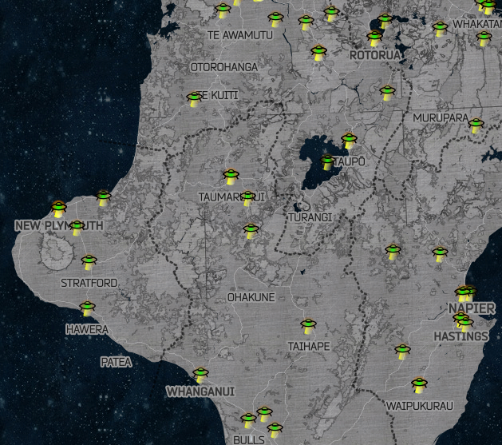
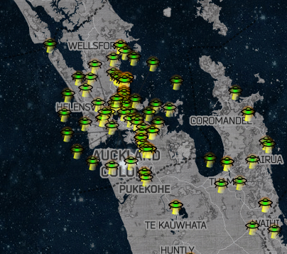
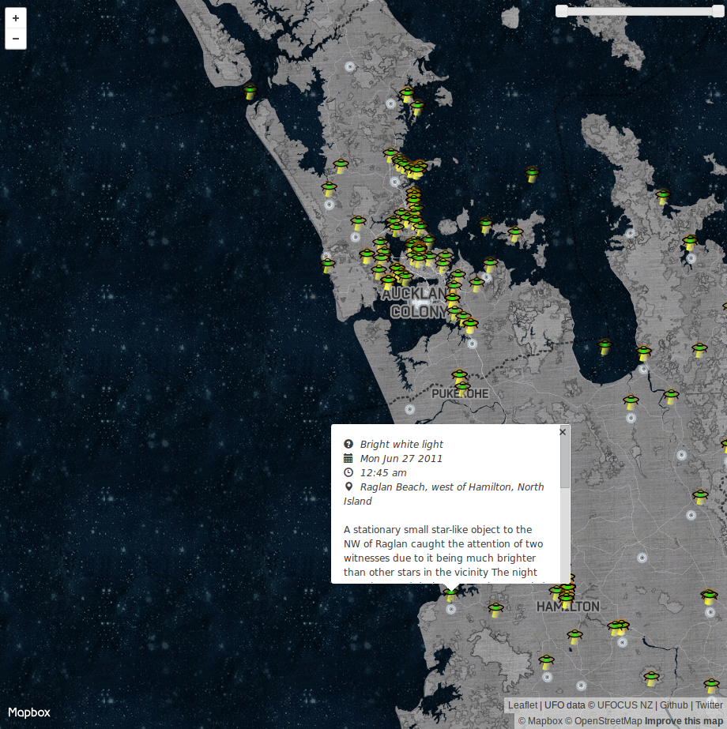

# New Zealand UFO Sightings

A Python scraper for UFOCUS NZ UFO sightings, and a MapBox/Leaflet map that then displays the . scraped data. Parses with BeautifulSoup4, tentatively uses pandas, and geocodes pretty poorly with geopy (Neonatim). If you use this tool to extract the information into a friendly format, bear in mind that you must not redistribute that content without the express permission of UFOCUS NZ.

## Requirements

- [virtualenv](https://pypi.python.org/pypi/virtualen) ... the rest is taken care of for you

## Usage

- Clone the repository and `cd` into it
- `virtualenv venv`
- `source venv/bin/activate`
- `pip install -r requirements.txt`
- `python PythonUFOCUSNZ/scrape.py` (this does all the web scraping and geocoding, producing a GeoJSON file)
- Then you can use the GeoJSON however you want, or you can start up a simple webserver to check out a sample webpage I've already prepared: in the same directory as `index.html`, try `python -m SimpleHTTPServer`, then navigate to `localhost:8000` in your web browser.

# Disclaimer

The data that this scraper scrapes is © [UFO Focus New Zealand Research Network](http://www.ufocusnz.org.nz/) (UFOCUS NZ) 2015. I have **not** asked their permission, but I am **not** redistributing any of UFOCUS' content—merely using it for private enjoyment. This is a tool that allows individuals to view the information that UFOCUS presents on their website in a slightly different format. I am not redistributing any of that content without UFOCUS' permission. If someone else chooses to use this tool to distribute content that that person does not hold copyight for, I cannot be held liable for that.

# Sample

<!--  -->

<!--  -->

# Thanks to...

- [jawj/OverlappingMarkerSpiderfier-Leaflet](https://github.com/jawj/OverlappingMarkerSpiderfier-Leaflet)
- [dwilhelm89/LeafletSlider](https://github.com/dwilhelm89/LeafletSlider)
- MapBox (esp. *Space Station Earth* basemap, designed by [Eleanor Lutz](https://www.mapbox.com/blog/space-station-earth/))
- Leaflet
- ...and everyone who has spotted something unexplainable
